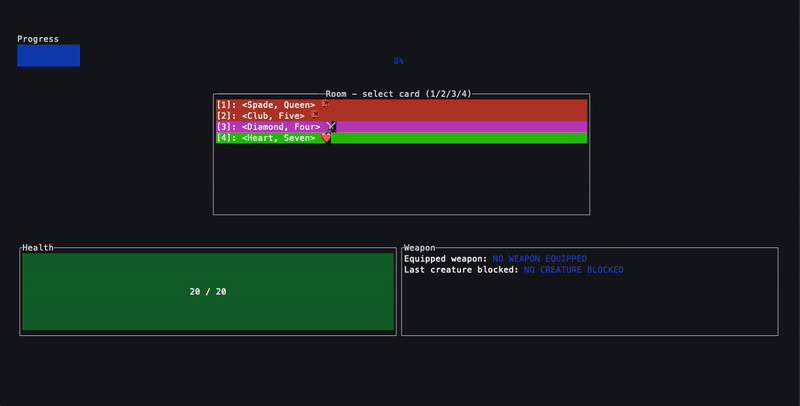

# Scoundrel
A single-player card game.


## Installation
For macOS users (on Apple Silicon):
```bash
brew install jamesyeap/jamesyeap/scoundrel
```
* TODO: fix release workflow script to also build and release for macOS users on x86 processors.
* There's currently no support for users on Windows and Linux at the moment.

## How To Play
- Watch this [tutorial](https://www.youtube.com/watch?v=Gt2tYzM93h4) (credits to [@Rulies](https://www.youtube.com/@Rulies))

## Roadmap
- [x] Implement game engine
- [x] Implement UI in Ratatui 
- [ ] Improve splash screen
- [ ] Implement an in-game tutorial
- [ ] Track which cards have already been drawn
- [ ] Improve end-of-game screens (won/lost)
- [ ] Add persistence (can view past runs)
- [ ] Publish it as a web-app with [Ratzilla](https://github.com/orhun/ratzilla)
- [ ] Add feature where at the end of the run, you can compare your score against a bot (that is also playing the same run)
   - You should be able to see the steps that the bot has taken. 
- [ ] Automatically publish new releases to brew - my brew repo is [here](https://github.com/jamesyeap/homebrew-jamesyeap)